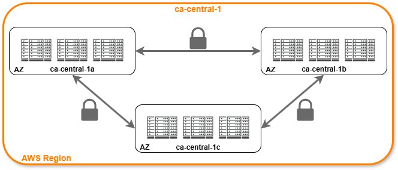

# Regions
Regions are globally **geographically distinct locations**, consisting of one or more availability zones. Each region is **physically isolated** from and independent of every other region in terms of location, power, water supply
- A region has multiple availability zones 
- An availability zone is made up of one or ore datacenter
- All AZs in a region are interconnected with high-bandwidth, low-latency-networking
- AZs are within 100km of each other
- AWS region names are generally composed of a region code and a region name
    - Ex: **us-east-1**

## Regional Services vs Global Services
- Regional Services
    - AWS scopes their AWS Management console on a selected region. This will determine **where** an AWS service will be launched and what will be seen within an AWS service
    - You generally don't explicitly set the region for a service at the time of creation
- Global Services
    - Some AWS services operate across multiple regions and the region will be fixed as "global"
        - Ex: Amazon S3, CloudFront, Route53, IAM
    - For these services at the time of creation:
        - There is no concept of region. Ex: IAM
        - A single region must be explicitly chosen
        - A group of regions are chosen. Ex: CloudFront distributions

## Availability Zones
- An **Availability Zone (AZ)** is a physical location made up of one or more datacenters
- A datacenter is a secured building that contains thousands of computers
- A region will **generally** contain 3 AZs
- Datacenters within a region will be isolated from each other (different buildings), nut they will be close enough to provide low-latency (usually less than 10ms), over fully redundant, dedicated metro fiber providing high-throughput network connection
- It is common to run workloads in at least 3 AZs to ensure services remains available in case of one or two datacenters fails
- AZz are represented by a region code, followed by a letter identifier
    - Ex: **us-east-1-<ins>a</ins>**
- A subnet is associated with an AZ
- You never choose the AZ when launching resources, but you choose the subnet which is associated to the AZ
- A region has multiple availability zones

