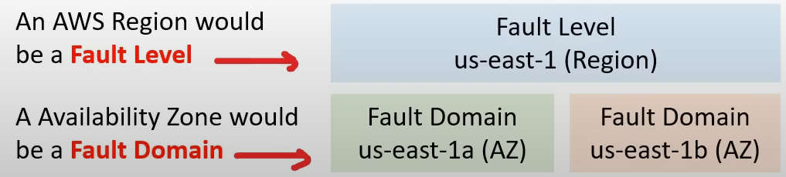

# Fault Tolerance
## What is fault domain?
A fault domain is a section of a network that is vulnerable to damage if a critical device or system fails. The purpose of a fault domain is that a failure occurs, it will not cascade outside that domain, limiting the possible damage.

It is possible to have fault domains inside fault domains.

The scope of fault domain could be:
- specific servers in a rack
- an entire rack in a datacenter
- an entire room in a datacenter
- the entire datacenter

## What is fault level?
A fault level is a collection of fault domains

## Global Infrastructure
- Each region os designed to be **isolated** from other region
    - This achieves the greatest possible fault tolerance and stability
- Each AZ is **isolated**, but the AZs in a region are connected through low-latency connection
- Each AZ is designed as an **independent failure zone**

### Failure Zone
- AZs are physically separated within a typical metropolitan region and are located in lower risk flood plains
- Are discrete uninterruptible power supply and onsite backup generation facilities
- Datacenters located in different AZs are designed to be supplied by independent substations to reduce the risk of an event on the power grid impacting more than one AZ
- AZs are all redundantly connected to multiple tier-1 transit providers