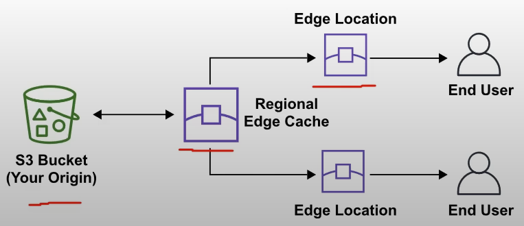

# Points of Presence

Points of Presence (PoP) is an intermediate location between AWS region and the end user. This location could be a datacenter or a collection of hardware

For AWS, PoP is a datacenter **owned by AWS or a trusted partner** that is utilized by AWS Services related **for content delivery or expedited upload**

*Edge locations* are datacenters that hold cached of the most popular files(web pages, css, js, images, videos), so that the distance of delivery to the end user are reduced

*Regional Edge Locations* are datacenters that hold much larger caches of less-popular files. It is used to reduce a full round trip and also to reduce the cost of transfer fees

## Services
The following AWS Services use PoP **for content delivery or expedited upload**

- Amazon CloudFront: is a **Content Delivery Network(CDN)** service that:
    - You point your website to CloudFront so that route requests to nearest Edge Location caches
    - Allows to choose an **origin** (such as web-server or storage) that will be source of cache
    - Caches contents of what origin would return to various edge locations around the world

- Amazon S3 Transfer Acceleration: reduces the variability in Internet routing, congestion and speeds that can affect transfers, and logically shortens the distance to S3 for remote applications
- AWS Global Accelerator: can find the optimal path for the end user to your web servers. Global Accelerator are deployed within edge locations so you can send traffic to an Edge Location instead of directly to your web application