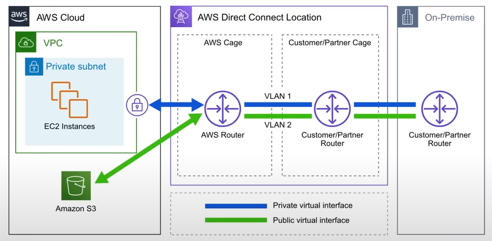

# AWS Direct Connect
AWS Direct Connect is a **private/dedicated connection between your datacenter, office, co-location and AWS**
- Helps to reduce network costs and increase bandwidth throughput (great for high traffic networks)
- Provides a more consistent network experience than a typical internet-based connection

