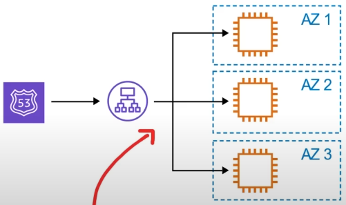

# High Availability
High availability is the ability for your service to **remain available** by ensuring there is **no single point of failure** and/or ensure a certain level of performance

Running your workload across multiple AZs ensures that if 1 or 2 AZs become unavailable, your service/application remains available

## Elastic Load Balancer
A load balancer allows you to evenly distribute traffic to multiple servers in one or more datacenters, If a datacenter or server becomes unavailable, the load balancer will route the traffic to only available datacenters with servers