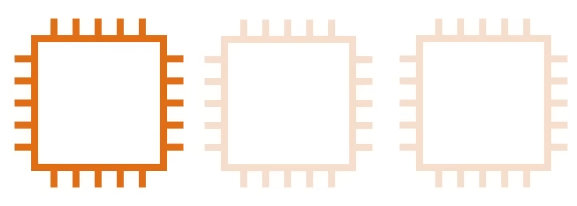

# High Elasticity
**Automatically** increase or decrease your capacity based on the current demand on traffic, memory and computing power

- Horizontal scaling
    - Scaling **Out**: Add more servers of the same size
    - Scaling **In**: Removing underutilized servers of the same size
- Vertical scaling: it is generally hard for traditional architecture. So you'll usually only see horizontal scaling described with Elasticity

## Auto Scaling Groups (ASG)
An AWS feature that will automatically add or removve servers based in scaling rules you define on metrics