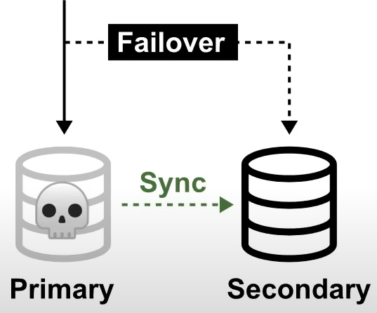

# Highly Fault Tolerance
Your ability for your service to ensure there is no **single point of failure**. It prevents the chance of failure

## Fail-Over

Fail-Overs is when you have a plan to **shift traffic** to a redundant system in case of the primary system fails

A common example is having a copy(secondary) of your database where all ongoing changes are synced. The secondary system is not in use until a fail over occurs and it becomes the primary database

## RDS Multi-AZ
RDS Multi-AZ is when you run a duplicate standby database in another AZ in case your primary database fails