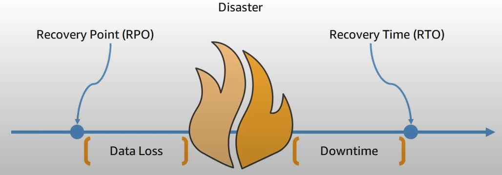

# Business Continuity Plan (BCP)
A business continuity plan (BCP) is a document that outlines how a business will continue operating **during an unplanned disruption in services**

- Recovery Point Objective (RPO): the maximum acceptable amount of data loss after an unplanned data-loss incident, expressed as an amount of time. How much data are you willing to lose?

- Recovery Time Objective (RTO): the maximum amount of downtime your business can tolerate without incurring a significant financial loss. How much time are you willing to go down?
